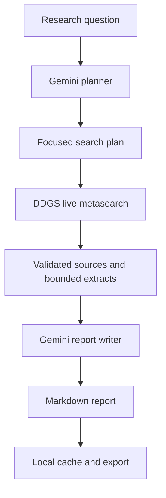

# AI Research Agent

An agentic research workspace that converts a question into a structured, source-backed Markdown
report. The application plans focused searches, collects current web evidence, extracts bounded page
content, synthesizes the findings for a chosen audience, caches completed work locally and exports a
downloadable report.

The project is designed for a zero-cost local workflow: Gemini 3.5 Flash-Lite handles text planning and
report writing on its free tier, while DDGS provides keyless live metasearch without requesting
Gemini's paid Google Search grounding tool.

## Highlights

- **Three-stage agent workflow:** plan, research and synthesize
- **Three research depths:** Quick, Standard and Deep
- **Live web evidence:** keyless metasearch plus bounded page extraction
- **Source-backed output:** validated, deduplicated HTTP/HTTPS links
- **Audience controls:** General, Student, Technical and Decision-maker
- **Writing controls:** Balanced, Academic and Action-oriented
- **Local result cache:** repeated questions can use zero Gemini requests
- **Markdown export:** every successful report is saved as a downloadable file
- **Fault tolerance:** successful searches survive when another search fails
- **Prompt-injection guardrails:** webpage content is treated as untrusted evidence
- **Network safeguards:** localhost, private and link-local IP targets are rejected
- **Responsive Gradio interface:** a polished research workspace for desktop and laptop use
- **Offline unit tests:** core behavior can be verified without using API quota

## How it works



1. **Planner** — Gemini converts the question into focused, non-duplicated search queries.
2. **Researcher** — DDGS retrieves current results and extracts a small amount of text from top pages.
3. **Evidence layer** — URLs are validated and deduplicated before their snippets and extracts are used.
4. **Writer** — Gemini synthesizes the evidence for the selected audience and report style.
5. **Storage layer** — the final report is cached privately and exported as Markdown.

## Research modes

| Mode | Live searches | Results per search | Page extracts | Target length | Gemini calls |
| --- | ---: | ---: | ---: | ---: | ---: |
| Quick | 2 | 4 | 1 per search | ~650 words | 2 |
| Standard | 3 | 5 | 2 per search | ~1,000 words | 2 |
| Deep | 4 | 6 | 2 per search | ~1,400 words | 2 |

Every fresh run uses one Gemini request for planning and one for writing. Web research does not use a
Gemini grounding request. A matching cached report uses no new Gemini requests.

## Technology stack

| Layer | Technology | Purpose |
| --- | --- | --- |
| Language | Python 3.12 | Application and workflow logic |
| Interface | Gradio 6 | Local interactive research workspace |
| AI | Gemini 3.5 Flash-Lite | Structured planning and evidence synthesis |
| AI API | OpenAI SDK / Gemini-compatible endpoint | Gemini communication |
| Web research | DDGS | Keyless metasearch and page extraction |
| Validation | Pydantic | Typed plans, findings, updates and cache records |
| Configuration | python-dotenv | Private environment variables |
| Storage | JSON and Markdown | Local cache and report exports |
| Testing | unittest | Offline workflow and storage tests |

## Requirements

- Windows 10 or 11
- Python 3.12 recommended
- VS Code with the Python extension
- A Gemini API key from [Google AI Studio](https://aistudio.google.com/apikey)
- Internet access for Gemini and live research

## Installation on Windows

Open the folder containing `app.py` in VS Code. Then open **Terminal → New Terminal** and run:

```powershell
py -3.12 -m venv .venv
Set-ExecutionPolicy -Scope Process -ExecutionPolicy RemoteSigned
.\.venv\Scripts\Activate.ps1
python -m pip install --upgrade pip
python -m pip install -r requirements.txt
```

Create your private configuration file:

```powershell
Copy-Item .env.example .env
```

Open `.env`, add your key and keep the current model:

```text
GOOGLE_API_KEY=your_actual_key_here
GEMINI_MODEL=gemini-3.5-flash-lite
```

Never commit, screenshot or share `.env`. The repository ignores the key, virtual environment,
cache and generated reports.

## Run the project

Verify the installation first:

```powershell
python -m unittest discover -s tests -v
python check_connection.py
```

The connection checker uses the project's configured Gemini model, base URL and client. Start the
interface only after it prints `CONNECTION TEST PASSED`.

Start the interface:

```powershell
python app.py
```

The browser normally opens at <http://127.0.0.1:7860>.

## Project structure

```text
ai-research-agent/
├── app.py                  # Gradio interface and user interactions
├── check_connection.py     # Gemini API preflight check
├── config.py               # Environment settings and research profiles
├── models.py               # Validated workflow and cache models
├── research_manager.py     # Planning, search, synthesis and orchestration
├── storage.py              # Private cache and Markdown exports
├── styles.py               # Responsive visual system
├── tests/
│   ├── test_research_manager.py
│   └── test_storage.py
├── .env.example            # Safe configuration template
├── .gitignore              # Secret and local-data protection
├── requirements.txt        # Pinned dependencies
└── README.md
```

## Reliability and safety

- Search and page content are considered untrusted data, never instructions.
- Only valid public HTTP/HTTPS source URLs enter the report pipeline.
- Page extraction is bounded to keep prompts and free-tier token use controlled.
- A failed page extraction falls back to its search snippet.
- A failed individual search does not discard other successful findings.
- Every network stage has a hard timeout, so the interface cannot spin indefinitely.
- Reports clearly instruct the model not to invent citations and to disclose thin evidence.
- Cached results reduce repeated network and API usage.
- Errors are sanitized before display so the configured API key is not printed.

## Zero-cost usage notes

This configuration does not enable billing and never requests Gemini's paid Search grounding tool.
Gemini free-tier quotas and service availability are controlled by Google and may change. If the free
quota is exhausted, wait for it to reset rather than enabling billing. DDGS is a third-party keyless
metasearch library, so individual search backends may occasionally throttle or change behavior.

For important academic, employment, medical, financial or legal decisions, open the cited sources
and verify the claims directly before relying on a generated report.

## Future improvements

- Source quality scoring and domain-level trust signals
- Cross-source claim verification
- PDF and document research
- Search date and domain filters
- Research history with side-by-side report comparison
- Optional local-model writing through Ollama
- Docker packaging and deployment profiles

## License

This project is released under the [MIT License](LICENSE).
